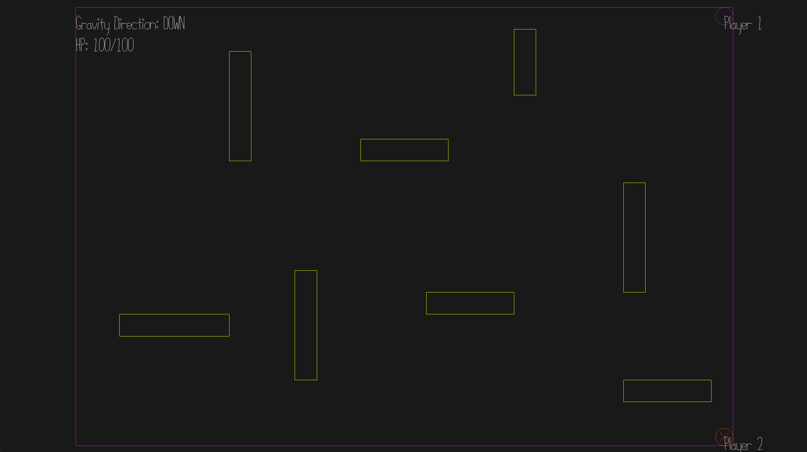

# Chaotic Shooting Game

**Author**: Joanna Yao

**Design**: A platform shooting game except that the gravity changes to any of the four direction every 5 second for each player; if you die, you cannot shoot anymore but can still move around and get shot by the bullets, so you can block the damage if you want to make the game a bit more chaotic!

**Networking**: Clients send controls to the server, the server updates all the game state and sends relevant information to each client (including player information such as position, velocity, HP and gravity direction, as well as position of all the bullets on the screen), so that each client can use these information to render the correct game state.

**Screen Shot**:

**How To Play**: WS or AD to move (depending on gravity direction), SPACE to jump, L to shoot

This game was built with [NEST](NEST.md).

